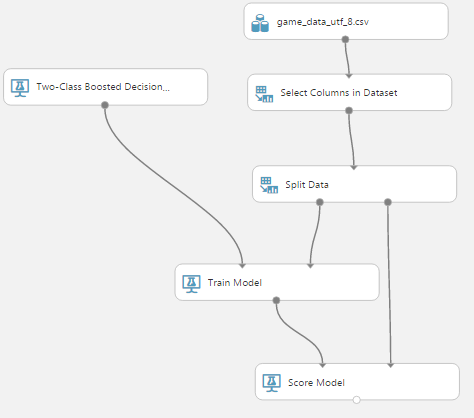
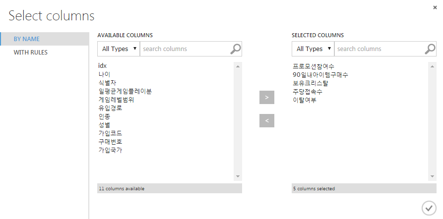
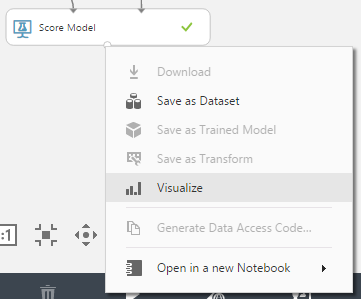
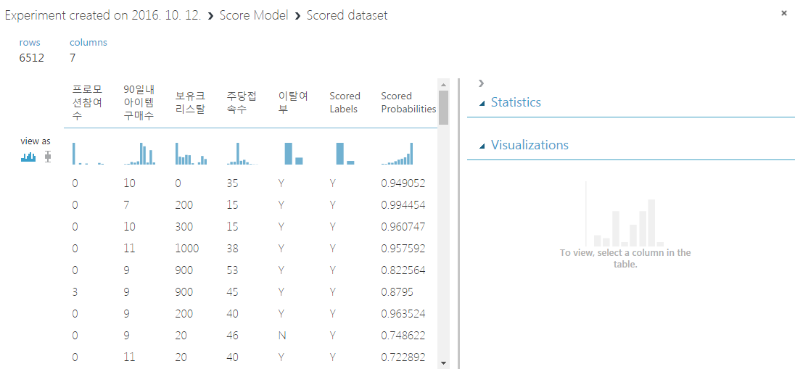
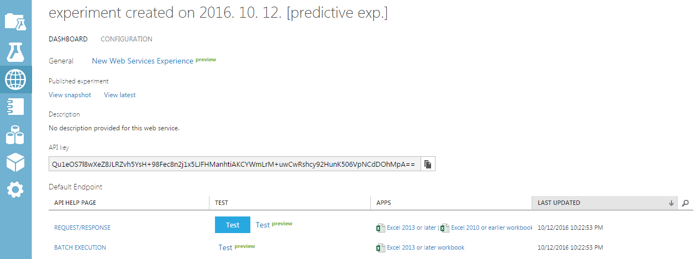

# Azure ML Studio
[Microsoft Azure Machine Learning Studio](http://studio.azureml.net)에 로그인.

## 데이터 추가
왼쪽 메뉴바의 **Datasets** 선택 후 하단 **Add**버튼 클릭. csv 형태의 데이터 업로드.
여기서는 [m-dual-project/ml-data](https://github.com/m-duel-project/ml-data)리포에 올라온 game_data_utf_8.csv를 업로드함.

## 모델 생성
왼쪽 메뉴바의 **Experiments** 선택 후 하단 **Add**버튼 클릭.
그 후 아래와 같이 모델 구성.

필요한 노드는 검색해서 찾는게 빠름.

*Selected Columns in Dataset*의 노드를 선택 후 우측 프로퍼티 패널에서 *Launch column selector*로 컬럼 셀렉터 창을 열고, 아래와 같이 컬럼들을 선택함.

하단 **Save**버튼 클릭, **Run**버튼 클릭하여 모델 실행.
모든 노드에 초록색 체크사인 확인 후 마지막 노드의 아웃풋에 **우클릭 > Visualize**

데이터 가시화 패널을 통해 학습된 데이터의 스코어링 결과를 얻을 수 있음.

## 예측모델 및 웹서비스 생성
하단 메뉴바의 **Set up web service** 호버링하여 **Predictive web service** 선택.
*Predictive Experiment* 탭이 생성되며 아래와 같은 메세지가 보임.

    Experiment created on 2016. 10. 12. [Predictive Exp.]

다시 **Run**한 후, **Deploy web service**을 클릭.
약간의 시간이 걸린 후, 다음과 같은 웹서비스 탭이 생성됨.

**Test**버튼을 눌러 간단하게 테스트 가능함.

*API Key*는 RESTFUL API를 사용하기 위한 키값. POST request의 Authorization 헤더에 Bearer 타입으로 사용됨.

API Help Page의 **REQUEST/RESPONSE**링크를 클릭하면 API 사용을 위한 도큐먼트 및 예제코드들이 상세히 나옴.